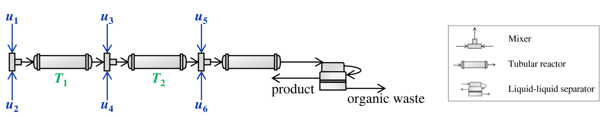
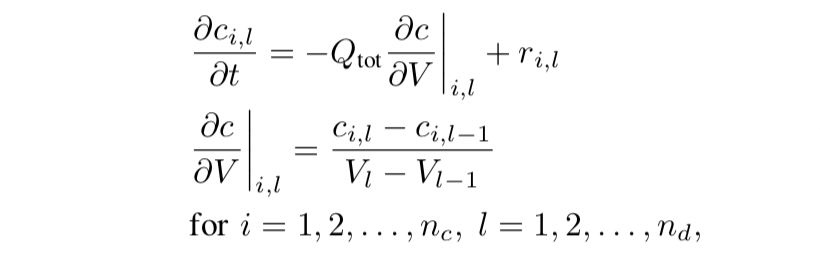
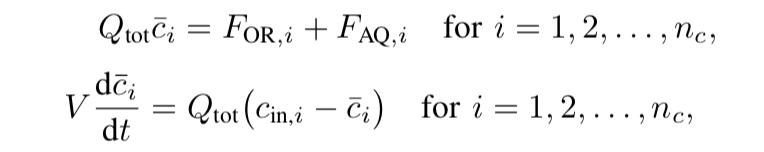
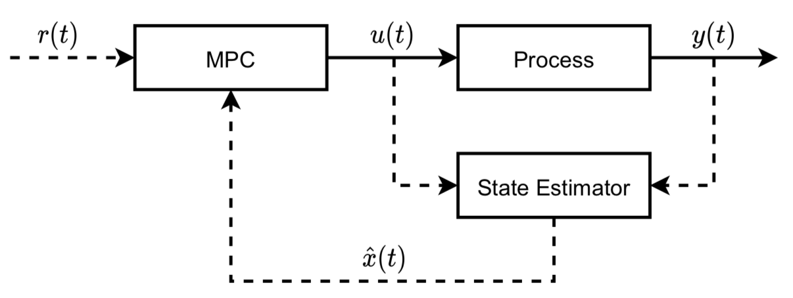
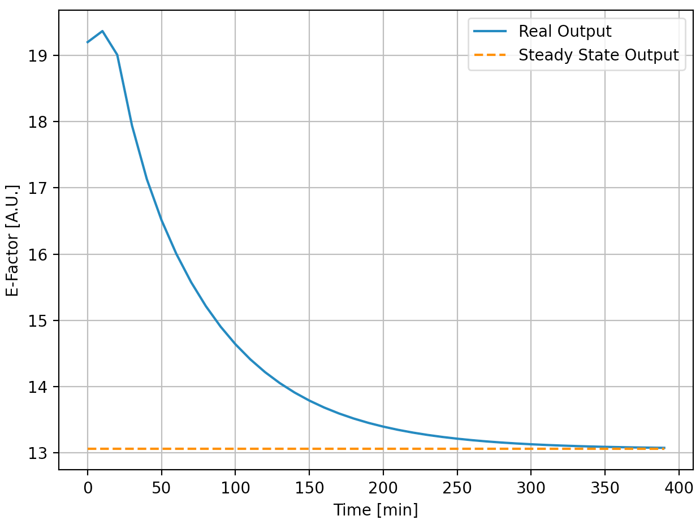

AtropineEnv
===========

Introduction
------------

What is atropine? We can simply treat it as one medication that benefits human beings. A corresponding continuous production flow can be described as below:

The whole flow contains *six* stream inputs, *two* outputs (product and
waste stream), *three* mixers, *three* tubular reactors, and *one*
liquid-liquid separator. They are connected sequentially and the flow
directions can be shown as those arrows. Besides, in our project, the
flow rates of NO. 5 and 6 are kept constant.

Atropine Model
--------------

Here comes the 1st challenge, how to model the whole flow? Since the
flow has duplicate components, like input streams, mixers, and tubular
reactors, we can develop single
Stream, Mixer, TubularReactor, LLSeparator
and
Plant
python classes and reuse them. They are based on this
`paper <https://ieeexplore.ieee.org/document/9147331>`__. Let us go
through each of them.

-  Stream

For each input stream, it has 14 reactants. This model is simple and no differential equations are included. It just
helps calculate the related *mass flow rates*, *molar concentrations*,
and *mass concentrations* based on the input *volumetric flow rates*.

-  Mixer

It is supposed that all the reactants are fully and intensively mixed
and no reaction happened (no new species generated). By following a
basic mass conservation equation, the Mixer model
can be built.

-  TubularReactor

This model becomes complex because the partial differential equations
(PDEs) are included. The partial derivative of the *molar concentration*
of each species w.r.t *time* is modeled.

where :math:`c_{i,l}` is the molar concentration of species *i* at
discretization point *l*; *V* is the reactor volume; :math:`Q_{tot}`
is the total volumetric flow rate; :math:`r_{i,l}` is the reaction rate matrix.
This model is time-consuming because it has a double for-loop
that not only iterates all discretized points (:math:`n_{d}` =40) but also
iterates all 14 species.

-  LLSeparator

This part is also based on the mass conservation equation but the
differential-algebraic equations (DAEs) are introduced.

where :math:`F_{OR,i}` and :math:`F_{AQ,i}` are the molar flow rates of species *i* at
the organic and aqueous phases, respectively. Also, :math:`F_{OR,i}` and
:math:`F_{AQ,i}` are algebraic variables. Hence, the derivatives
can be calculated based on the above equation, so as the algebraic.

-  Plant

Now, let us assemble the above components together and get the whole
continuous flow. They are connected like Plant and are exactly following the design in Fig. 1. The updated
states
are based on the
derivatives 
of the three tubular reactors and one liquid-liquid separator, and the
algebraic 
of the liquid-liquid separator. Additionally, we have an extra step that
takes the mixing
process 
into consideration right before calculating the updated
state 
by `CASADI <https://web.casadi.org/>`__. In a nutshell, the **Stream**
and **Mixer** help us preprocess the data, and the **TubularReactor**
and **LLSeparator** provide the derivative and the algebraic for
updating states.

Control System
--------------

System Design
~~~~~~~~~~~~~

So far, we have a model that represents the whole flow and it is an
open-loop one. The next step is to design a linear MPC-based control
system to track the steady-state inputs and output ASAP. First of all,
let us design the overall control system as below:

where the **Process** refers to our plant model and **State Estimator**
refers to a `Kalman
filter <https://en.wikipedia.org/wiki/Kalman_filter>`__ that is used for
states estimation; :math:`r(t)` is the reference signal; :math:`u(t)` is the inputs
for the plant model and the Kalman filter; :math:`y(t)` is the output; :math:`x(t)`
is the states and :math:`\hat{x}(t)` is the estimation. The above linear system
can be described below:

.. code::

   x(k+1) = Ax(k) + Bu(k)

   y(k) = Cx(k) + Du(k)

kalman filter progresses like:

.. code::

   e(k) = y(k) - yhat(k)

   xhat(k+1) = Axhat(k) + Bu(k) - Ke(K)

where *e* is the error.

System Identification
~~~~~~~~~~~~~~~~~~~~~

In order to get the above matrics **A**, **B**, **C**, **D,** and **K**,
we can take advantage of a system identification package
`SIPPY <https://github.com/CPCLAB-UNIPI/SIPPY>`__. And training data can be generated by the open-loop model for the identification process.

-  With respect to the open-loop model , it has four inputs (volumetric
   flow rates u1, u2, u3, and u4 in Fig. 1) and one output (e-factor)
   that describes atropine production efficiency.

   .. image:: imgs/eq3.png

   The input data of the open-loop model can be acquired by random noise
   and the corresponding e-factor can be
   calculated 
   based on the algebraic (less than 0.1s per run). For our case, it
   seems only 200 rows of data is enough for linear model
   identification.

-  Similar to the ML model training, a training and testing data split
   method was applied.
   However, the linear trend of the output data requires to be removed and the processed output signal is shown below.

   .. image:: imgs/De-trendedOutputSignalvsTheOriginal.png
      :alt: Fig. 3 De-trended Output Signal vs The Original

-  System identification is pretty simple and we chose an
   identification method of N4SID and an order of
   2.
   Also, a performance
   metric 
   is designed. Finally, after the system identification, we have the
   following system:

.. math::

   x(k+1) = \begin{bmatrix} 0.8314 & -0.235 \\ 0.1032 & 0.8634 \end{bmatrix} x(k) + \begin{bmatrix} 0.2570 & 1.8423 & 0.2785 & -0.6279 \\ -0.3092 & -0.7418 & -0.1148 & 0.3814 \end{bmatrix} u(k) \\

.. math::

   y(k) = \begin{bmatrix} -8.6962 & -9.7070 \end{bmatrix} x(k) \\

.. math::

   K = \begin{bmatrix} -0.0279 \\ -0.0243 \end{bmatrix}

System Implementation
~~~~~~~~~~~~~~~~~~~~~

We generated below the trajectory with `MPC <https://en.wikipedia.org/wiki/Model_predictive_control>`_, and ended the simulation once it reaches the steady state (we considered this as a termination condition)
The whole simulation represents 400 minutes in real life and the results are shown below:

.. image:: imgs/mpc2.png
   :alt: Fig. 5 Track of Four Inputs

It can be seen that the control system successfully worked and both the
inputs and the output reach the steady-state. The whole process (data generation, system identification,
and MPC control) takes less than 10 seconds.

AtropineEnv module
------------------

Following the discription above, we provide APIs as below:

.. automodule:: smpl.envs.atropineenv
   :members:
   :undoc-members:
   :show-inheritance:
   :noindex:
