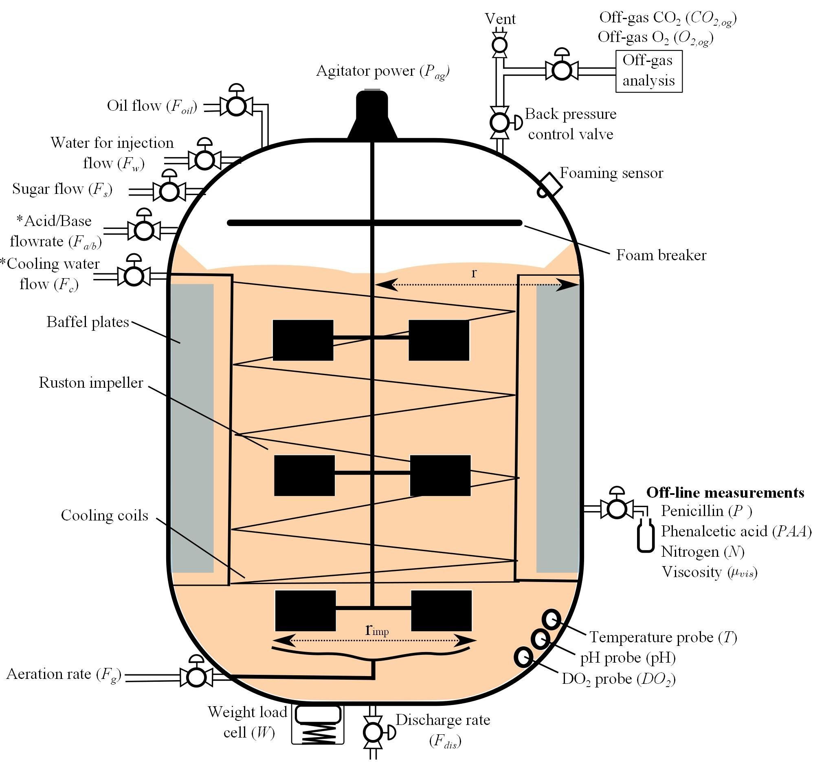
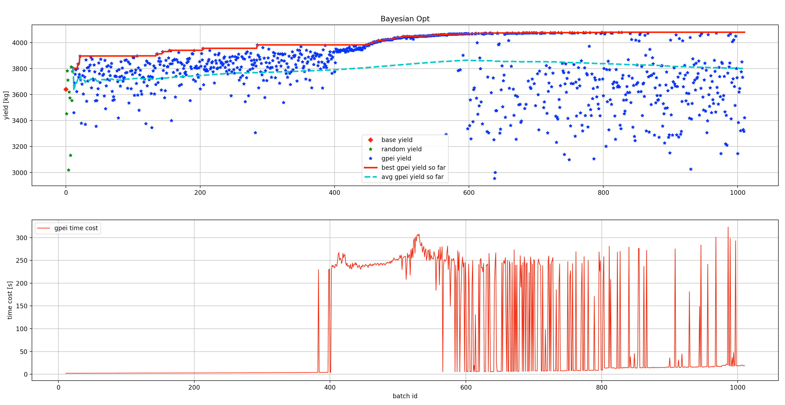

PenSimEnv
=========

The Penicillin Fermentation Env aims to simulate the penicillin production process. The simulation itself is based on `PenSimPy <https://github.com/smpl-env/PenSimPy>`_ and `The development of an industrial-scale fed-batch fermentation simulation <https://www.sciencedirect.com/science/article/abs/pii/S0168165614009377>`_.

There are in total 15 features, namely ['Discharge rate', 'Sugar feed rate', 'Soil bean feed rate', 'Aeration rate', 'Back pressure', 'Water injection/dilution', 'pH', 'Temperature', 'Acid flow rate', 'Base flow rate', 'Cooling water', 'Heating water', 'Vessel Weight', 'Dissolved oxygen concentration', 'Yield Per Step']. By default, we set each episode (or 'batch' in the manufacturing industry) to have a duration of 230 hours in real life, and the time interval between each step is 12 minutes. The detailed reactor description is shown below:

For a controller, we want to optimize the episode production (or batch yield), while avoiding extreme inputs, outputs, or changes that can potentially break the reactor. In order to maintain the safety constraints, we provide the input and state setpoints (it is an equilibrium, when input=setpoint_input and state=setpoint_state, the state is still setpoint_state for the next step), and we restricted the input search space to be within +/- 10% of setpoint inputs.

We also want to share the performance of a practical baseline recipe and a learnable controller based on Gaussian Process based Bayesian Optimization with the expected improvement acquisition function (gpei), which contains 10 random starts +
   1000 gpei searches, as shown below:

The base penicillin yield (in red diamond point, ~3640 kg) is based on
the baseline recipe without any optimizations. The first 10 random
searching results are plotted in green stars and the following 1000 gpei
searches are displayed in blue stars. The red line refers to the best
yield so far and the cyan dashed line shows the average yields so far,
respectively. Also, the time cost for each optimization step (mainly on
gpei) was recorded and displayed in red. Even though The performance varies on the BayesOpt implementation and configuration, our experiments show that there is around 12% improvement for the best run and 4% on average across all the batches.

PenSimEnv module
----------------

Following the discription above, we provide APIs as below:

.. automodule:: smpl.envs.pensimenv
   :members:
   :undoc-members:
   :show-inheritance:
   :noindex:
