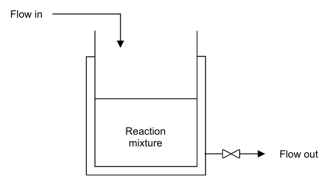
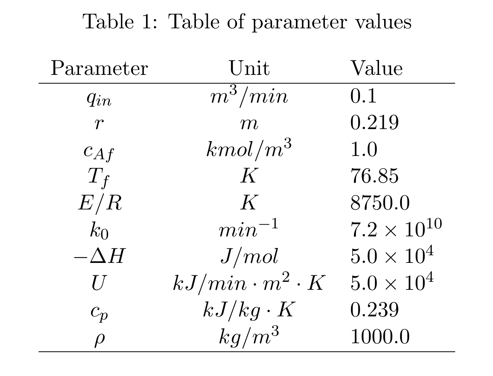

ReactorEnv
==========

We define the reactor as a Continuous Stirred Tank Reactor (CSTR) Process Model, which provides the necessary conditions for a reaction to take place. Because it is a continuous process, reactants and products are continuously fed and withdrawn from the reactor respectively.

In this example, a single first order irreversible exothermic reaction of the form A → B takes place. Since the reaction is exothermic, thermal energy is removed from the reactor through a cooling jacket. 

The following assumptions are taken in deriving the model:

- The reaction mixture is well mixed. This implies that there are no spatial variations  in the reaction mixture.
  
- Negligible or no heat losses to the surroundings.

Performing a component balance on reactant A, the following ordinary differential equation is obtained

.. math::

    \frac{dc_A}{dt} =\frac{q_{in}}{\pi r^2h}(c_{Af} - c_A) - k_0 \exp(-\frac{E}{RT})c_A

where :math:`c_A` is the concentration of reactant A in :math:`kmol/m^3`, :math:`t` is the time in :math:`min`, :math:`q_{in}` is the volumetric flow rate of the inlet stream in :math:`m^3/min`, :math:`r` is the radius of the reactor in :math:`m`, :math:`h` is the level of reaction mixture in the reactor in :math:`m`, :math:`c_{Af}` is the concentration of reactant A in the feed stream in :math:`kmol/m^3`, :math:`k_0` is the pre-exponential factor in :math:`min^{-1}`, :math:`E/R` is the ratio of reaction activation energy to the universal gas constant in :math:`K` and :math:`T` is the reaction mixture temperature in :math:`K`.

Similarly, an energy balance can be conducted to obtain the following energy balance equation

.. math::

      \frac{dT}{dt} = \frac{q_{in}}{\pi r^2h}(T_{f} - T) +  \frac{-\Delta H}{\rho c_p} k_0 \exp(-\frac{E}{RT})c_A + \frac{2U}{r\rho c_p}(T_c - T)

where :math:`T_f` is the temperature of the feed stream in :math:`K`, :math:`\Delta H` is the heat of reaction in :math:`kJ/kmol`, :math:`\rho` is the density of the reaction mixture in :math:`kg/m^3`, :math:`c_p` is the specific heat capacity of the reaction mixture in :math:`kJ/kg \cdot K`, :math:`U` is the heat transfer coefficient in :math:`kJ/min \cdot m^2 \cdot K` and :math:`T_c` is the coolant temperature.

Finally, deriving an overall material balance around the reactor leads to the following equation

.. math::

    \frac{dh}{dt} = \frac{q_{in}-q_{out}}{\pi r^2}

where :math:`q_{out}` is the volumetric flow rate of the contents out of the reactor in :math:`m^3/min`.

A summary of parameters values used in this project is presented in Table

In the CSTR process model described above, :math:`c_A`, :math:`T`, and :math:`h` are the state variables. The controlled variables are :math:`c_A` and :math:`h` while the manipulated variables are :math:`q_{out}` and :math:`T_c`. 

ReactorEnv module
-----------------

Following the discription above, we provide APIs as below:

.. automodule:: smpl.envs.reactorenv
    :members:
    :undoc-members:
    :show-inheritance:
    :noindex:
